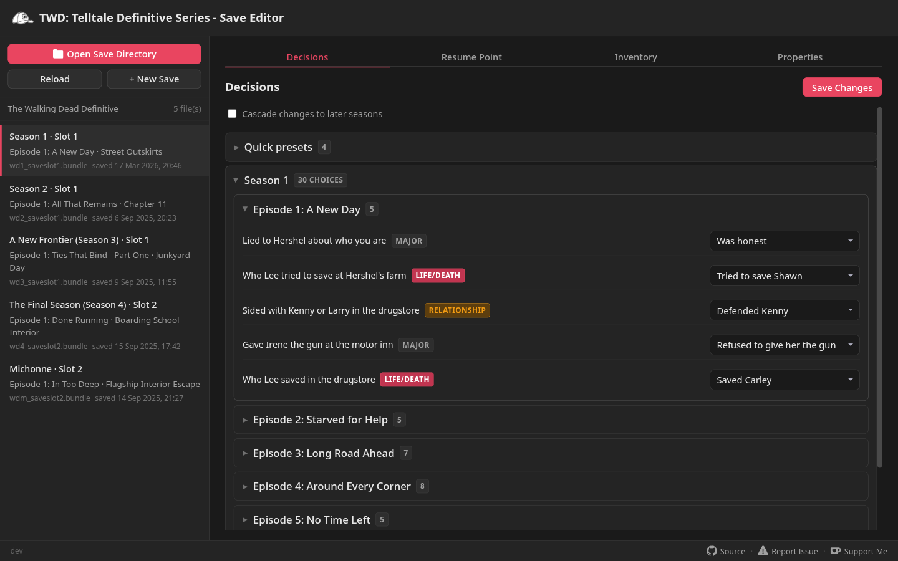
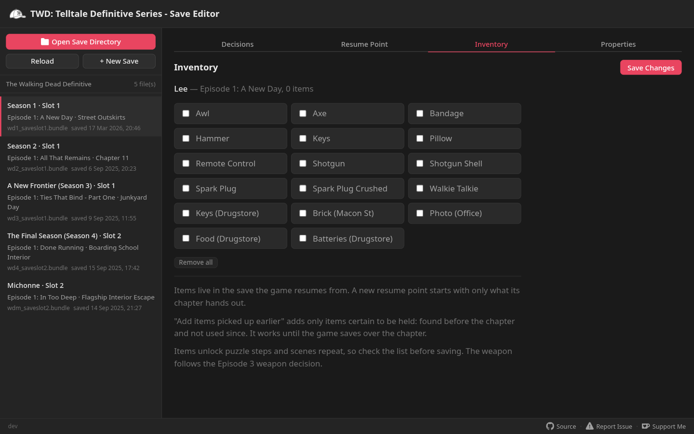

<h1 align="center">
  <br>
  TWD Save Editor
</h1>

<p align="center">
  A browser-based save editor for <strong>The Walking Dead: The Telltale Definitive Series</strong>.<br>
  <a href="https://twd-se.app/"><strong>twd-se.app</strong></a>
</p>

<p align="center">
  
  
  <a href="https://github.com/adds39939/twd-se/releases"></a>
  <a href="LICENSE"></a>
  <a href="https://ko-fi.com/adds39939"></a>
</p>

Open your save folder and the editor lists every save in it. For each one you can:

- change any tracked decision from a dropdown, or apply a preset such as "Side with Kenny" or "Leave with Kate"
- set the resume point: start an episode from the beginning, or jump to a chapter inside it with the decisions you picked
- edit the inventory of the save the game resumes from, or the Season 4 collectibles
- import decisions from the previous season's save the way the game does
- create a new save for any season, starting at the episode you choose

Saves are read and written in the game's own formats. Every file is backed up into a `backup_<timestamp>` folder inside the save folder before it is changed.

<p align="center">
  
  
</p>

## Seasons

| Season | Decisions | Resume points | Inventory |
|--------|-----------|---------------|-----------|
| Season 1 | ✅ | episode or chapter | Lee's items |
| 400 Days | ✅ | story or chapter | the survivor's items |
| Season 2 | ✅ | episode or chapter | Clementine's items |
| Michonne | ✅ | episode or chapter | Michonne's items |
| A New Frontier (Season 3) | ✅ | episode or chapter | Javier's items |
| The Final Season (Season 4) | ✅ | episode or chapter | collectibles found and placed |

## Using it

The game keeps its saves in `Documents\Telltale Games\The Walking Dead Definitive`.

On Linux and Steam Deck the folder is inside the Steam library the game is installed in: `steamapps/compatdata/1449690/pfx/drive_c/users/steamuser/Documents/Telltale Games/The Walking Dead Definitive`.

Open [twd-se.app](https://twd-se.app/) in Chrome, Edge or another Chromium browser, click **Open Save Directory** and pick that folder. The editor remembers the folder and opens it again on your next visit, or offers to reopen it when the browser asks for permission first. Click **Reload** after playing to read the folder again, and **Discard Changes** to reload one save and drop its unsaved edits. Chrome and Edge can also install the editor as an app from the address bar, and once installed it works offline.

Other browsers can upload the save files instead. **Download Changes** then downloads a zip of the files that changed; copy them into the save folder and delete any files listed in `files-to-delete.txt`.

## In the game

- Keep the game closed while you edit.
- The game shows three save slots for Seasons 1 and 2 (400 Days shares the Season 1 slots) and four for the other seasons.
- **New Save** uses the first slot with no files in the folder, so it never overwrites another save. When every slot the game shows is in use, it warns that the game won't load the new save unless it replaces an existing one.
- A save set to the start of an episode is listed as a new game: select the slot, pick the episode and press Play.
- If Steam reports a cloud sync conflict when the game starts, keep the local files.

If a save doesn't load or looks wrong, [open an issue](https://github.com/adds39939/twd-se/issues/new) and attach the slot's files: `wdN_saveslotX.bundle` and the `_wdN_saveslotX_*` files next to it.

## Building

You need the [.NET 10 SDK](https://dotnet.microsoft.com/download/dotnet/10.0).

```bash
dotnet run --project src/TwdSaveEditor.Web
```

Then open `http://localhost:5163`. `dotnet test` runs the unit tests and the Playwright browser tests, which publish the site and test the published build.

How the save formats work, how the resume points were worked out and how to get at the game's data are written up in [docs](docs/).

## License

[GNU General Public License v3.0](LICENSE).

The Walking Dead is a trademark of Robert Kirkman, LLC. Telltale is a trademark of Telltale, Inc. This project is not affiliated with either.
